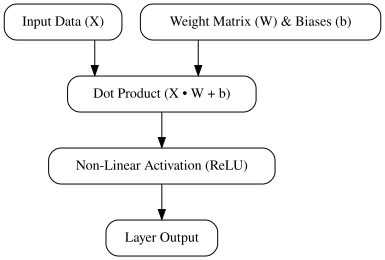
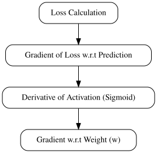

# Demystifying Neural Networks: From Matrix Multiplications to Backpropagation

## Core Architecture and Forward Pass



*A conceptual depiction of data flowing through a neural network layer during a forward pass.*

At the core of any neural network lies a sequence of transformations. Inputs are multiplied by learned weight matrices, added to bias vectors, and passed through non-linear activation functions. 

Here is a minimal working example of a single-layer forward pass using NumPy:

```python
import numpy as np

# Inputs: batch of 2 samples, 3 features each
X = np.array([[1.0, 2.0, 3.0], 
              [0.5, -1.0, 1.5]])

# Weights: 3 input features, 4 output neurons
W = np.array([[0.1, 0.2, -0.3, 0.4],
              [-0.5, 0.6, 0.1, -0.2],
              [0.3, -0.1, 0.2, 0.5]])

# Biases: 4 output neurons
b = np.array([0.1, -0.2, 0.3, 0.0])

# Forward pass: Dot product + bias
z = np.dot(X, W) + b

# Non-linear activation (ReLU)
def relu(x):
    return np.maximum(0, x)

output = relu(z)
print(output)
```

The mathematical intuition is straightforward. The dot product ($\mathbf{X} \cdot \mathbf{W}$) computes a weighted sum of inputs, projecting them into a new feature space. The bias vector shifts these hyperplanes away from the origin, granting the model translational freedom. Because stacked linear transformations collapse into a single linear operation, non-linear activation functions like ReLU ($\max(0, x)$) or Sigmoid ($\frac{1}{1 + e^{-x}}$) are mandatory. They break linearity, allowing the network to approximate complex, non-linear decision boundaries.

From a performance perspective, structuring these operations as batched matrix multiplications is critical. Modern CPU and GPU architectures rely heavily on cache hierarchies (L1, L2, L3) and tensor cores. Processing data in minibatches maximizes arithmetic intensity and spatial locality, ensuring contiguous memory access patterns that fully saturate hardware execution units.

## Gradient Descent and Backpropagation



*Backpropagation computes gradients backward through the computation graph using the chain rule.*

Training a neural network means iteratively adjusting weights to minimize a loss function. Once the forward pass computes the loss, backpropagation applies the chain rule of calculus to compute gradients of the loss with respect to every parameter. 

Consider a minimal computation graph where a weight $w$ scales an activation $x$, passing through a sigmoid function $\sigma$ to yield a prediction $\hat{y}$. Here is a Python code sketch demonstrating manual computation of these partial derivatives:

```python
import numpy as np

def sigmoid(z):
    return 1 / (1 + np.exp(-z))

# Forward pass inputs
x = 2.0
w = 1.5
y_true = 1.0

# Computation
z = w * x
y_pred = sigmoid(z)
loss = (y_pred - y_true) ** 2  # Mean Squared Error component

# Backward pass (manual derivatives via chain rule)
d_loss_ypred = 2 * (y_pred - y_true)
d_ypred_z = y_pred * (1 - y_pred)  # Derivative of sigmoid
d_z_w = x

# Chain rule composition
d_loss_w = d_loss_ypred * d_ypred_z * d_z_w
print(f"Gradient with respect to w: {d_loss_w}")
```

In deep architectures, computing these sequential products across many layers introduces failure modes. Vanishing gradients occur when weights are initialized too small; repeated multiplication of derivatives less than 1 (common in saturating activations like sigmoid) causes gradients to decay exponentially toward zero, halting early-layer learning. Conversely, exploding gradients happen when weights are initialized too large, causing gradients to grow exponentially and destabilize numerical updates.

To update parameters efficiently, standard Stochastic Gradient Descent (SGD) applies a fixed learning rate along the negative gradient. However, SGD struggles in ravines where surfaces curve steeply in one dimension and gently in another. Adaptive optimizers like Adam mitigate this by maintaining exponential moving averages of past gradients (first moment) and uncentered squared gradients (second moment). This enables per-parameter adaptive learning rates, generally yielding faster and more reliable convergence than standard SGD.

## Common Pitfalls and Debugging Neural Networks

Training neural networks introduces a distinct class of silent failures where code executes without errors, yet the model fails to learn. One primary cause of training stagnation is improper input normalization or naive weight initialization. When features span vastly different scales, the loss landscape becomes an elongated ravine. Standard initialization methods like zeros or arbitrary constants cause symmetric activations, leading to vanishing or exploding gradients. Utilizing modern strategies like He or Xavier initialization ensures that variance remains stable across layers, preventing signals from dying out early.

To catch divergence before models waste compute time, tracking internal metrics via TensorBoard is essential. The following checklist helps establish a robust observability pipeline:

*   Monitor pre-activation and post-activation histograms per layer to detect dead ReUs or saturation.
*   Track gradient norms globally and per-layer to spot exploding gradients early.
*   Verify that training loss decreases monotonically over the first few mini-batches on a small subset of data.

Another frequent failure mode is overfitting, where models memorize training data instead of learning generalizable patterns. This is diagnosed by monitoring the divergence between training and validation loss curves. While training loss continues to drop, validation loss plateaus and eventually increases, signaling loss of generalization. To counteract this, applying dropout regularization randomly zeroes out subset activations during training, forcing the network to learn redundant, robust representations. Combining this with early stopping based on validation metrics ensures models maintain strong out-of-sample performance.

## Production Readiness and Next Steps

Moving a neural network from a research script to a production environment requires optimizing runtime performance and enforcing strict reliability guarantees. You must transition your model from dynamic graph representations into optimized static runtimes to eliminate overhead and lower latency.

* **Export to Optimized Formats:** Convert your trained weights and computational graph into production-ready formats like ONNX. This decouples the model from your training framework, allowing engines like TensorRT or ONNX Runtime to perform aggressive operator fusion, memory planning, and hardware-specific kernel optimizations.
* **Benchmark Under Load:** Measure your inference pipeline by testing throughput against stringent P99 latency constraints. Simulate concurrent request loads to identify bottlenecks, thread contention, and queue saturation before deployment.
* **Production Checklist:** Implement a robust deployment strategy covering core safeguards:
  * Apply post-training quantization (such as FP16 or INT8) to reduce memory footprints and accelerate matrix multiplication.
  * Sanitize and validate all input tensors to prevent dimension mismatches, NaN injections, and adversarial malformations.
  * Establish automated fallback mechanisms and circuit breakers to route traffic safely if the inference service degrades or throws unrecoverable errors.